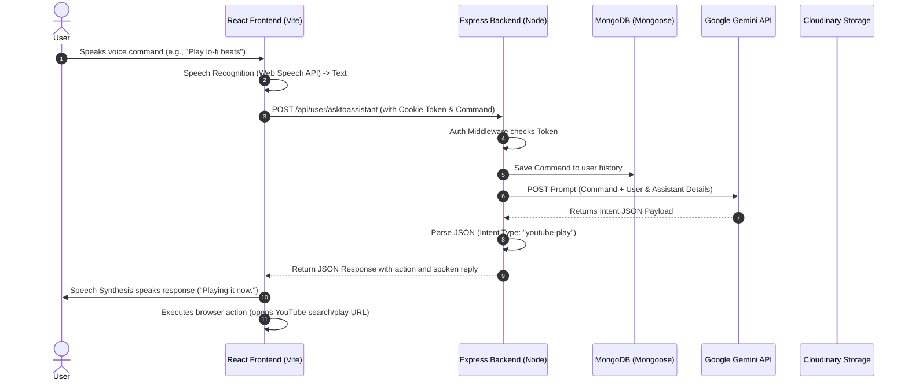

# 🎙️ AURA: Next-Gen AI Virtual Assistant

[](https://reactjs.org/)
[](https://vitejs.dev/)
[](https://tailwindcss.com/)
[](https://expressjs.com/)
[](https://www.mongodb.com/)
[](https://deepmind.google/technologies/gemini/)
[](https://vercel.com/)

A premium, voice-activated virtual assistant application powered by **Google Gemini LLM**. Aura interprets spoken commands in real-time, classifies user intent, and generates personalized responses or triggers specific browser-based actions (like searches, media control, and application launching).

---

## ✨ Features

- 🗣️ **Intelligent Voice Interface**: Real-time speech-to-text input processing and speech synthesis audio output.
- 🧠 **Smart Intent Parsing**: Utilizes Gemini-2.5-Flash to classify spoken commands into specific actions (e.g., General Conversational, Google/YouTube Search, Media Playback, Date & Time retrieval, App Launching).
- 👤 **Custom Identity Settings**: Customize your assistant's name and visual profile (image upload processed via Cloudinary).
- 🔒 **Cookie-Based JWT Auth**: Robust authentication flow featuring secure session cookies working dynamically in local and cross-origin production environments.
- 🕒 **Dynamic Context Recognition**: Features a Moment.js-backed engine to resolve date, time, day, and month queries locally.
- 📜 **Chat History Tracking**: Chronological database persistence of user commands and interactions.

---

## 🏗️ Architecture & Request Flow

The following sequence illustrates how Aura processes a voice command:



---

## 🛠️ Technology Stack

| Layer | Technologies | Primary Use Case |
| :--- | :--- | :--- |
| **Frontend** | React 19, Vite, Tailwind CSS v4, React Router DOM v7, React Icons | Single-page UI, audio processing, and navigation. |
| **Backend** | Node.js, Express v5, Axios | Serverless REST API routing and integration. |
| **Database** | MongoDB, Mongoose | Schema definitions and persistent document storage. |
| **AI Engine**| Gemini 2.5 Flash API | Conversational command analysis and intent matching. |
| **Storage**  | Cloudinary, Multer (os.tmpdir) | Secure assistant profile image uploading and storage. |
| **Auth**     | JSON Web Token (JWT), Cookie-Parser | Secured HTTP-Only cookie-based session management. |

---

## 🚀 Local Setup & Installation

### Prerequisites
- Node.js (v18 or higher)
- MongoDB account (Atlas or local installation)
- Cloudinary account
- Gemini API Key (obtain from [Google AI Studio](https://aistudio.google.com/))

### 1. Clone & Install Dependencies

```bash
git clone https://github.com/saurabhxcod/AI-Virtual-Assistant-.git
cd AI-Virtual-Assistant-
```

Install backend dependencies:
```bash
cd backend
npm install
```

Install frontend dependencies:
```bash
cd ../frontend
npm install
```

### 2. Environment Variables Configuration

Create a `.env` file in the `backend/` directory:

```env
PORT=8000
MONGODB_URL="your-mongodb-connection-string"
JWT_SECRET="your-jwt-secure-random-secret"
CLOUDINARY_CLOUD_NAME="your-cloudinary-cloud-name"
CLOUDINARY_API_KEY="your-cloudinary-api-key"
CLOUDINARY_API_SECRET="your-cloudinary-api-secret"
GEMINI_API_URL="https://generativelanguage.googleapis.com/v1beta/models/gemini-2.5-flash:generateContent?key=YOUR_GEMINI_KEY"
FRONTEND_URL="http://localhost:5173"
```

Create a `.env` file in the `frontend/` directory:

```env
VITE_API_URL="http://localhost:8000"
```

### 3. Running Locally

Start the backend server (runs on port `8000`):
```bash
cd backend
npm run dev
```

Start the frontend development server (runs on port `5173`):
```bash
cd ../frontend
npm run dev
```

---

## 🔗 Backend API Endpoints Reference

### Authentication Routes (`/api/auth`)

- **`POST /signup`**
  - Registers a new user.
  - *Payload*: `{ "name": "...", "email": "...", "password": "..." }`
  - *Response*: User JSON object & sets JWT cookie.
  
- **`POST /signin`**
  - Authenticates credentials.
  - *Payload*: `{ "email": "...", "password": "..." }`
  - *Response*: User JSON object & sets JWT cookie.

- **`GET /logout`**
  - Clears the JWT cookie session.
  - *Response*: `{ "message": "log out successfully" }`

### User & Assistant Routes (`/api/user`)
*(Requires dynamic cookie token auth)*

- **`GET /current`**
  - Fetches details of the currently logged-in user.

- **`POST /update`**
  - Updates assistant settings. Supports JSON metadata or `multipart/form-data` uploads.
  - *Body Form-Data*: `assistantName` (string), `assistantImage` (file upload), or `imageUrl` (fallback image string).

- **`POST /asktoassistant`**
  - Sends a voice command to be processed by the assistant engine.
  - *Payload*: `{ "command": "What time is it?" }`
  - *Response*:
    ```json
    {
      "type": "get-time",
      "userInput": "What time is it",
      "response": "current time is 12:45 PM"
    }
    ```

---

## 🌐 Vercel Deployment Guide

To deploy this project to Vercel, you should import this repository as **two separate Vercel projects** (one for the Backend API, and one for the React Frontend).

### 🖥️ 1. Backend Project Deployment
1. Go to your **Vercel Dashboard** and click **Add New** > **Project**.
2. Import the cloned repository.
3. In the project setup panel:
   - **Framework Preset**: Choose `Other` or `None`.
   - **Root Directory**: Select `backend`.
4. Open the **Environment Variables** section and configure all keys matching your backend `.env`:
   - `MONGODB_URL`
   - `JWT_SECRET`
   - `CLOUDINARY_CLOUD_NAME`
   - `CLOUDINARY_API_KEY`
   - `CLOUDINARY_API_SECRET`
   - `GEMINI_API_URL`
   - `FRONTEND_URL` *(set this to your Vercel Frontend URL after deployment)*
5. Click **Deploy**. Vercel will build your Express app as serverless routes defined in `vercel.json`.

### 🎨 2. Frontend Project Deployment
1. Go to your **Vercel Dashboard** and click **Add New** > **Project**.
2. Import the same repository.
3. In the project setup panel:
   - **Framework Preset**: Choose `Vite`.
   - **Root Directory**: Select `frontend`.
4. Open the **Environment Variables** section and configure the backend URL:
   - `VITE_API_URL` *(set this to your Vercel Backend URL)*
5. Click **Deploy**. Vercel will build the frontend assets and host them statically.
6. Once deployed, remember to update the backend's `FRONTEND_URL` environment variable to match your frontend domain for CORS authorization.
